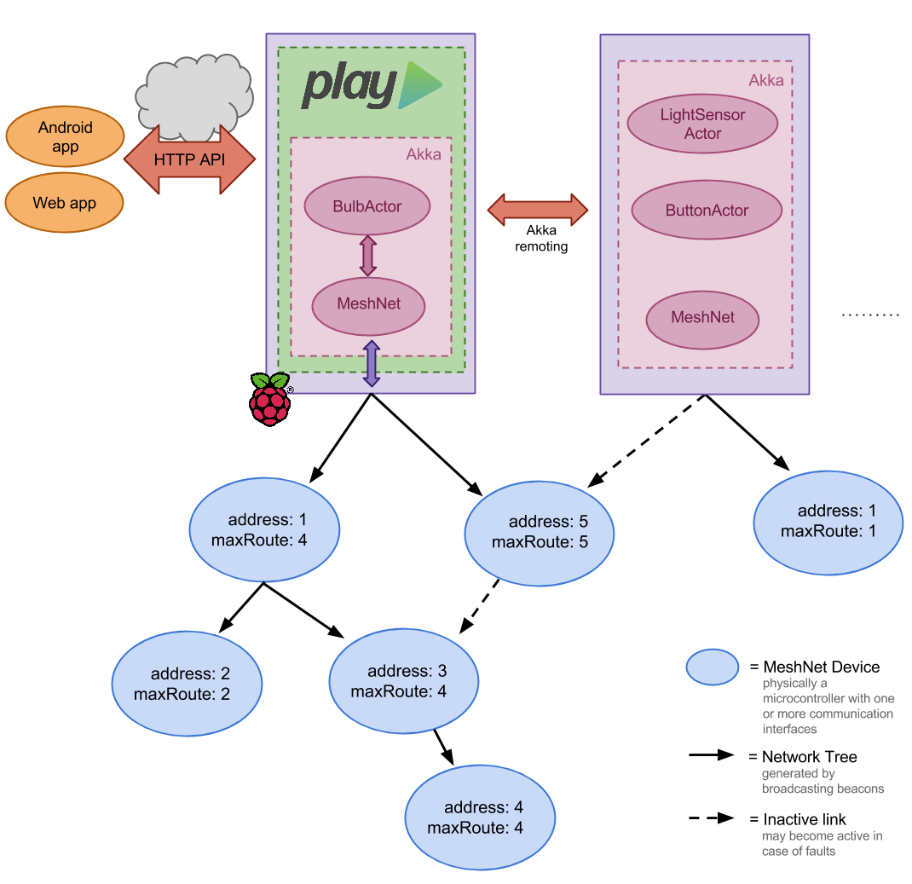
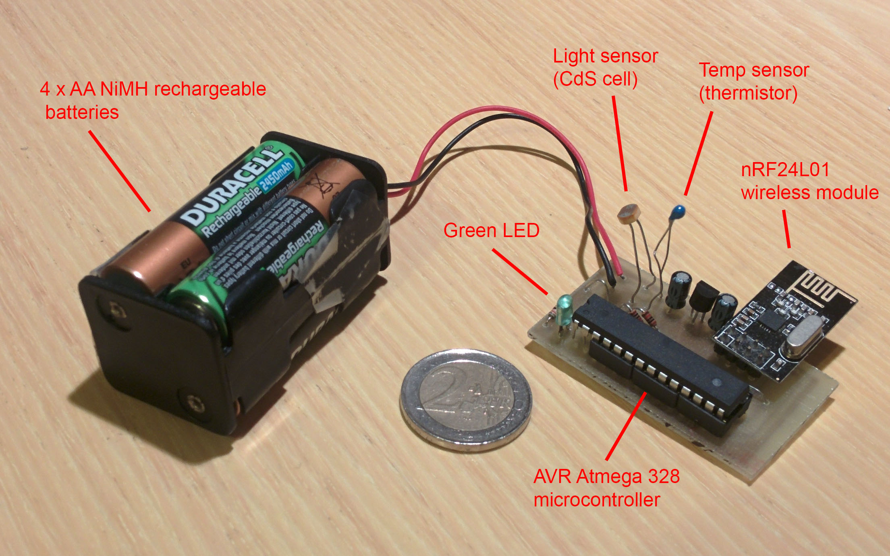
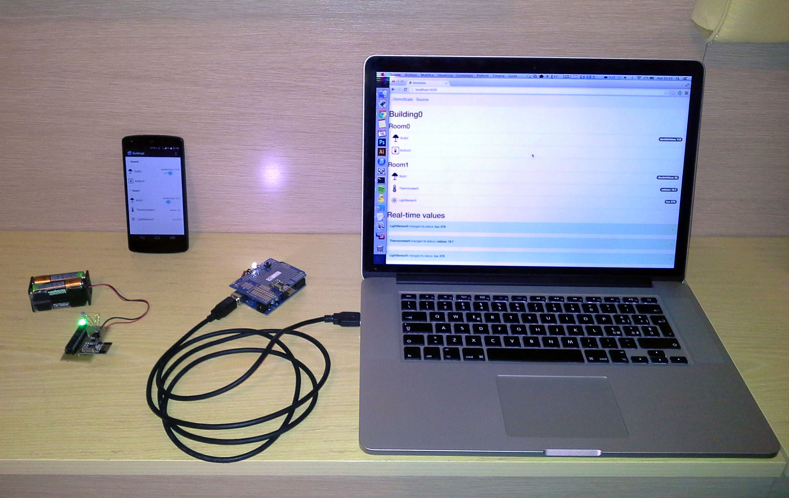
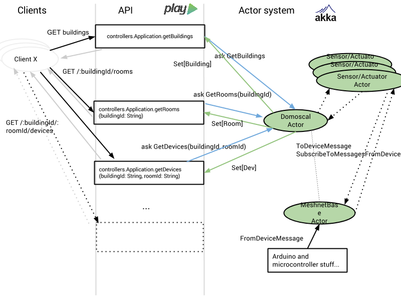

DomoScala
=========

Home automation with Scala and Arduino.


Installation and first run
==========================

- install [RXTX native driver for your OS](http://jlog.org/rxtx-mac.html). *This is only needed if you want to control real hardware. If you just want to try a sample with simulated sensors/actuators, skip this step.*
- clone DomoScala repo
- `cd <yourLocalPath>/DomoScala`
- launch Typesafe Activator script with `./activator`. This will download all that is need to launch the application.
   - launch the application (listening on port 9000) with `run`
   - go to [http://localhost:9000/](http://localhost:9000/). This will compile and launch the application itself.

Motivations
===========

This project aims to implement a low-cost **home automation system using modern technologies** such as [Scala lang](http://www.scala-lang.org), [Play framework](http://www.playframework.com), [Akka](http://akka.io/), [Arduino](http://arduino.cc/), low power wireless mesh networks, and other exciting stuff. 

*At the time of writing, we only implemented the core of the system, as a proof of concept.*

System architecure
==================
The core of the system is a [Play framework](https://www.playframework.com) app. Since Play is built on top of [Akka](http://akka.io), most of the system components are modeled as Akka [actors](http://en.wikipedia.org/wiki/Actor_model).

The app [will] allow the user to configure the structure of its buildings. Each **building** is represented as a set of **rooms**, and each room is modeled as a set of **devices**. All devices are abstracted by **actors**, interacting via **message-passing**.

**NB**: *At the time of writing, the system configuration is hard-coded inside the app.*

The system consists of:
* a **server** running the Play application (it should work in any device capable of running Java, even a [Raspberry Pi](http://www.raspberrypi.org/))
* one or more **Arduino** or other custom boards with sensors (temperature, buttons, ...) and actuators (lamps, locks, ...)
* one or more **clients** that let the users interact with the system (Web application, Android app, ...)

Hardware devices
----------
The home automation system is able to control **real electrical sensors and actuators** through the use of **microcontrollers**, small computers that are able to directly control many electrical components. The microcontroller platform that we choose is the very popular [Arduino](http://arduino.cc). It's possible to use the official **Arduino Uno board**, or also make a completely **custom board based on the AVR Atmega328**, the same chip of the official one.

A good home automation system is composed by a lot of **small devices**, that are spread in the various parts of the house. So it's very important for the devices to have a low cost and to have a **wireless connection with an high range** (greater than Wifi) and **low power consumption**, in order to be potentially battery powered.


With these technologies we can achieve a better **wireless coverage** than Wifi, a greater **flexibility** since the devices could be battery operated, and a much lower **cost** than using many Raspberry Pi with Wifi or Ethernet connections in many places of the house.

API
-----
The app provide some **REST APIs** to interact with the system. For example, a client can retrieve the list of buildings in a system with a simple API call.

```
GET   /buildings    
```

The app also provide APIs to get notified when something happens inside the system (aka **publish/subscribe**). This feature allows other developers to develop client app that receive updates in *real-time*.
To achieve this goal, we use **[Web Sockets](http://en.wikipedia.org/wiki/WebSocket)** combined with **actors**.
For example, a client can be notified of all system event (coming from all buildings in the system).

```
GET   /push    
```

The APIs support both **fine grained and coarse grained granularity** when querying system status. Thus, a client can request/subscribe for/to information from all buildings to a single device.
For more details on APIs, check `conf/routes` file.

A sample response of a `GET   /buildings` request may have the following format:

```json
{
   "status":"OK",
   "buildings":[
      {
         "id":"Building0",
         "rooms":[
            {
               "id":"Room0",
               "devices":[
                  {
                     "id":"Bulb0",
                     "devType":"bulb"
                  },
                  {
                     "id":"Button0",
                     "devType":"button"
                  }
               ]
            },
            {
               "id":"Room1",
               "devices":[
                  {
                     "id":"Bulb1",
                     "devType":"bulb"
                  },
                  {
                     "id":"Thermometer0",
                     "devType":"temp"
                  },
                  {
                     "id":"LightSensor0",
                     "devType":"light"
                  }
               ]
            }
         ]
      }
   ]
}
```

A new value published by a device, for example by a sound sensor with id `SoundSensor0` installed in a room with id `Room0` in a building with id `Building0`, may have the following format:

```json
{  
   "buildingId":"Building0",
   "roomId":"Room0",
   "deviceId":"SoundSensor0",
   "um":"decibels",
   "status":{  
      "value":0.6545045971870422
   }
}
```

Frontend
--------
The frontend use **HTML5**, **[Bootstrap](getbootstrap.com)** and **[jQuery](jquery.com)** to present a minimal web interface to the user. The interface is updated in real-time thanks to the usage of the Web Socket APIs depicted above.
This approach avoids the need to continuously reload the page to get the latest informations about the system.

Android
----------
The Android application for the moment is just a simple remote control app that use REST APIs and Web Sockets to update some list views.
It's pretty the same as the html+js fronted, but with a native Android UI.

Implementation
==============

Arduino and Meshnet
-------------------
In order to make the DomoScala system works with real sensors and actuators, you need at least one Arduino Uno (or custom compatible) board running a sketch (firmware) that uses the MeshNet library, and connected with the computer running the DomoScala Play application through a serial connection (usually the USB port of the Arduino).

If the **Arduino** has two communication interfaces connected (for example the USB Serial and the nRF24l01 wireless module), it can **act as a router** and relay packets between devices connected to the interface 1 (for example the computer running DomoScala) and the ones connected to interface 2 (for example another Arduino with a nRF24l01 wireless module), thanks to the mesh networking functionality of MeshNet library.


In the sketch, you basically have to implement an handler code for each type of messages arriving from the MeshNet base (the computer running DomoScala). In the example sketch above there is some code that perform some I/O on the Arduino pins, to which you can connect some sensors and actuators.

This is an overview of how the various parts of the system are interconnected:



The "MeshNet Devices" in the bottom of the diagram are the various Arduino or custom boards on which you can install sensors or actuators, interconnected with a mesh network with the computer running the Play application.

The **topology** of the mesh network is automatically generated at startup of the Play app in the server, by broadcasting a beacon signal in order to discover the active MeshNet devices and their interconnections.


Hardware devices prototypes
-------------------
We have designed and build some prototype of home automation devices with some simple sensors and actuators, that can communicate and work perfectly with the DomoScala system.

This is a fully wireless and battery operated one made with a custom PCB:



The **thermistor** and the **CdS photoresistor** are connected to analog input (ADC) pins, and the **LED** to a PWM output. *The sensors and actuators of this board are hardcoded in current implementation of DomoScala to be put in the "Room1". room.*

Here you can see the whole example prototypes system running:




Actors and API
--------------



The main actor of the system is *DomoscalaActor* (`actors.DomoscalaActor.scala`). It wraps all the system configurations and structure and all actors (and APIs) has to interact to this one.

*MeshnetBase* (`actors.Meshnet.scala`) wraps the interaction with meshnet library. It's a facade that allows the interaction with meshnet (and so, with physical devices) via message-passing.

*DeviceActor* (`actors.DeviceActor.scala`) represents an abstract device actor. In its companion object are defined all the messages that all concrete device actor instances can accept/exchange. All concrete implementation of this actor are in `actors.device` package.

The interaction between all system components is defined in `test` folder, containing all tests specs.

Every APIs is **asynchronous from the bottom up**. The system handles every request in an [asynchronous, non-blocking way](https://www.playframework.com/documentation/2.3.x/ScalaAsync). Thus, if the client request a heavy operation to the server, the client will be blocked while waiting for the response, but nothing will be blocked on the server, and server resources can be used to serve other clients.

[Web Sockets](https://www.playframework.com/documentation/2.3.x/ScalaWebSockets) allows the implementation of Publish/Subscribe feature. Thus, there's a **two way full duplex communication channel** between clients and the server that enables the flow of new contents from the server to the client once the contents are produced, timely.
